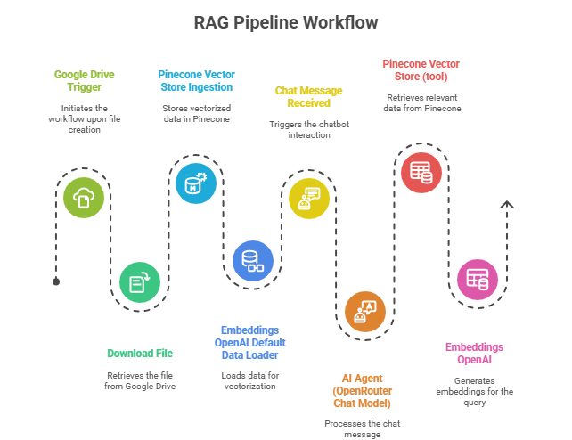
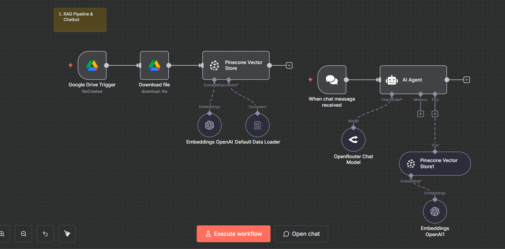

# RAG Pipeline & Chatbot

A sophisticated Retrieval-Augmented Generation (RAG) system built with n8n that enables AI chatbots to answer questions using custom knowledge bases rather than relying solely on generic web-sourced data.



## 📋 Overview

This n8n workflow creates an intelligent chatbot capable of providing accurate, context-aware responses by leveraging your organization's documentation, knowledge bases, and custom content. The system combines document ingestion, vector embeddings, and large language models to deliver precise answers grounded in your specific data.

## ✨ Key Features

- **Custom Knowledge Base**: Train the chatbot on your company's documentation, API docs, PDFs, or any text-based content
- **Intelligent Retrieval**: Uses vector similarity search to find the most relevant information for each query
- **Context-Aware Responses**: Provides accurate answers based on retrieved documents rather than general knowledge
- **Flexible LLM Support**: Compatible with OpenAI GPT-4, Google Gemini, and other language models
- **Scalable Architecture**: Handles large document collections efficiently using vector databases

## 🏗️ Architecture

### Workflow Components

1. **Document Ingestion Pipeline**
   - Collects and processes documents from various sources
   - Supports multiple formats (PDFs, text files, web pages, API documentation)
   - Chunks documents into manageable segments for embedding

2. **Embedding Generation**
   - Converts text chunks into high-dimensional vector representations
   - Uses OpenAI embeddings or compatible alternatives
   - Ensures semantic similarity can be measured mathematically

3. **Vector Database Storage**
   - Stores document embeddings in Pinecone Vector Store
   - Enables fast similarity search across thousands of documents
   - Maintains document metadata for context retrieval

4. **Query Processing**
   - Accepts user questions through chat interface
   - Embeds user queries using the same embedding model
   - Performs similarity search to find relevant document chunks

5. **AI Response Generation**
   - Combines retrieved context with user query
   - Sends augmented prompt to LLM (GPT-4/Gemini)
   - Generates accurate, context-grounded responses

### Workflow Nodes

- **Google Drive Trigger**: Monitors for new documents to ingest
- **Download File**: Retrieves documents for processing
- **Pinecone Vector Store**: Manages document embeddings and retrieval
- **Embeddings OpenAI**: Generates vector representations of text
- **When Chat Message Received**: Handles incoming user queries
- **AI Agent**: Orchestrates the RAG pipeline with tool integration
- **OpenRouter Chat Model**: Connects to various LLM providers



## 🚀 Getting Started

### Prerequisites

- n8n instance (self-hosted or cloud)
- API keys for:
  - OpenAI (for embeddings and/or LLM)
  - Pinecone (for vector database)
  - Google Drive (for document ingestion)
  - OpenRouter (optional, for alternative LLMs)


### Usage

1. **Index Your Documents**
   - Upload documents to the configured Google Drive folder
   - The workflow automatically processes and embeds new documents
   - Documents are stored in the Pinecone vector database

2. **Start Chatting**
   - Activate the workflow in n8n
   - Click "Open chat" to interact with the chatbot
   - Ask questions related to your indexed documents

3. **Query Examples**
```
   User: "What is our API rate limit policy?"
   Bot: [Retrieves relevant API documentation and provides accurate answer]

   User: "How do I authenticate with the payment gateway?"
   Bot: [Searches documentation and provides step-by-step instructions]
```

## 🎯 Use Cases

- **Internal Documentation Assistant**: Help employees find information in company wikis, policy documents, and handbooks
- **Customer Support Bot**: Provide instant, accurate answers based on product documentation and FAQs
- **Developer Portal Assistant**: Guide developers through API documentation and integration guides
- **Knowledge Base Chat**: Make organizational knowledge easily accessible through conversational interface
- **Onboarding Assistant**: Support new employees with instant access to training materials and procedures

## 🛠️ Technologies Used

- **n8n**: Workflow automation and orchestration
- **OpenAI Embeddings**: Text-to-vector conversion
- **Pinecone**: Vector database for similarity search
- **OpenAI GPT-4 / Google Gemini**: Large language models for response generation
- **Google Drive**: Document storage and triggering
- **OpenRouter**: LLM routing and access

## 📊 Performance Considerations

- **Embedding Quality**: Using OpenAI's `text-embedding-ada-002` provides excellent semantic understanding
- **Chunk Size**: Documents are split into 500-1000 token chunks for optimal retrieval
- **Retrieval Count**: Top 3-5 most relevant chunks are retrieved per query
- **Response Time**: Typical query response time is 2-4 seconds depending on document complexity

## 🔧 Customization


### Using Different LLMs
Replace the OpenRouter node with:
- Direct OpenAI connection
- Google Gemini API
- Anthropic Claude
- Local LLMs via Ollama

### Adding Document Sources
Extend the ingestion pipeline to include:
- Notion databases
- Confluence pages
- Website scraping
- Database queries
- Email content

